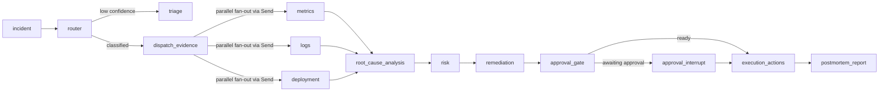
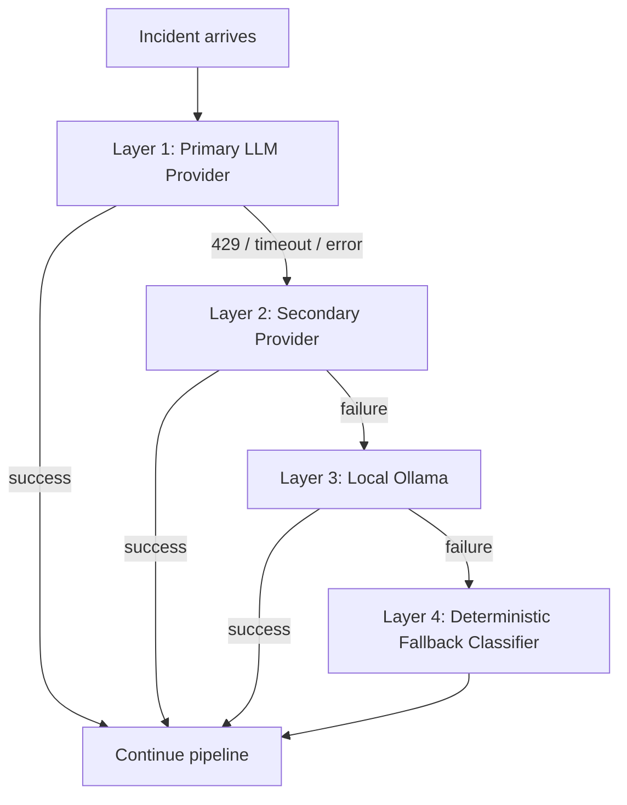

# SentinelOps AI

An uncertainty-aware incident reasoning system for infrastructure operations. Combines a FastAPI control plane, LangGraph-based orchestration, retrieval-grounded root-cause analysis, causal reasoning scaffolding, and a probabilistic evaluation framework to investigate operational incidents under strict operator control.

The system makes incident analysis auditable rather than conversational: agent outputs are structured, root-cause reasoning is explicit, evaluation is reproducible, and safety and approval paths are built into the orchestration graph. It is not a finished autonomous SRE system.

---

## Architecture

The repository is centered on a Python backend in `apps/api-server` and a Next.js dashboard in `apps/web-dashboard`.

Core backend components:

- FastAPI control plane for incidents, approvals, graph control, evaluations, and WebSocket streaming
- LangGraph StateGraph for deterministic orchestration of the incident pipeline
- Celery + Redis for background incident execution and scheduled tasks
- PostgreSQL for persistent storage of incidents, agent executions, evidence, approvals, remediations, postmortems, and workflow checkpoints
- Qdrant vector store for runbooks, patterns, prevention items, incident history, and operational memory
- Prometheus, Grafana, Loki, Tempo for local observability
- Retrieval layer with topology-aware hybrid retrieval, provenance tracking, and consistency checks
- Causal root-cause path with timed events, candidate causes, probabilistic scoring, and uncertainty propagation
- Multi-layer provider resilience with circuit breakers, operating mode management, and deterministic fallback classification
- Execution guardrails: tool allowlist, JWT approval tokens, risk-tier classification, and operating modes

### Orchestration Graph



Evidence collection uses LangGraph `Send` for parallel dispatch. Metrics, logs, and deployment agents run concurrently and converge at root cause analysis.

### Provider Resilience Chain



The pipeline never halts due to provider failure. Layer 4 is a zero-dependency rule-based classifier that activates automatically after provider exhaustion.

---

## Operational Pipeline

### Runtime Path

```
POST /incidents/webhook
  -> incident row created in PostgreSQL
  -> Celery task enqueued
  -> LangGraph graph invoked
  -> router: classification via resilient LLM client (4-layer fallback)
  -> dispatch_evidence: parallel fan-out
  -> metrics / logs / deployment: evidence collection via tool-using agent loop
  -> root_cause_analysis:
      evidence normalization -> timed events -> candidate causes ->
      probabilistic scoring -> UncertaintyEngine assessment ->
      escalation decision
  -> risk: blast-radius estimation (topology traversal + Monte Carlo)
  -> remediation: risk-ranked action planning
  -> approval_gate: interrupt if human approval required
  -> execution_actions: guarded tool execution (allowlist + approval token)
  -> postmortem_report: structured incident summary
```

Key runtime details:

- The router agent calls an LLM plus incident history retrieval from Qdrant. If all providers fail, the deterministic fallback classifier produces a valid classification.
- Root-cause reasoning is algorithmic once upstream evidence exists: it normalizes evidence, constructs timed events, generates candidate causes, scores them, and runs the UncertaintyEngine. The LLM is not directly involved in root-cause scoring.
- Risk assessment uses topology traversal over a service graph plus Monte Carlo estimation over traffic snapshots.
- Execution is guarded by tool allowlists, JWT approval tokens scoped to specific incidents, and risk-tier enforcement.
- Bootstrap state (thread_id, execution_id, status, operating_mode) is persisted before any provider interaction.

### Evaluation Path

The evaluation path is intentionally separate from runtime:

- `evaluation/orchestration_runner.py` runs the pipeline over benchmark fixtures
- All agents execute real code paths but use mocked LLM clients and mocked infrastructure responses
- No Celery tasks, no Slack notifications, no production telemetry queries, no database mutations
- Golden labels are used only by scorers, never by agents (corrected in Phase 40)

---

## Measured Numbers

These are engineering diagnostics from the current codebase. They measure specific properties under controlled conditions.

### Test Infrastructure

| Metric | Value |
|--------|-------|
| Passing tests | 1473 |
| Known failing test | 1 (pre-existing, `test_high_confidence_better_than_low`) |
| Test files | 103 |
| Test categories | unit, integration, evaluation, chaos, orchestration, production, resilience, replay, runtime |

Coverage includes deterministic evaluation, chaos testing, and operational replay.

### Evaluation Datasets

| Dataset | Size |
|---------|------|
| Benchmark incidents | 121 (106 original + 15 semantic mechanism) |
| Operational chaos incidents | 40 |
| Replayable operational incidents | 25 |
| Telemetry replay events | 100 |

### Operational Coverage

| Metric | Value |
|--------|-------|
| Chaos/failure profiles | 13 |
| Incident categories (golden labels) | 13 |
| Incident categories (benchmark payload) | 14 |
| Services referenced in benchmark | 17 |
| Operational realism scoring dimensions | 5 |

Chaos profiles: alert_storm, clock_skew, concurrent_outages, delayed_alerts, deployment_noise, duplicate_events, false_recovery, metric_freeze, partial_deployment, rollback_loop, split_brain, stale_replay, telemetry_blackout.

### Safety

| Property | Status |
|----------|--------|
| Dangerous remediation rejection rate (benchmark replay) | 100% (8/8 dangerous incidents rejected) |
| Execution side effects disabled in evaluation mode | Enforced via `ExecutionMode.EVALUATION` |
| Production mutation during evaluation | None (asserted in test suite) |
| Confidence collapse guard | Implemented (`UncertaintyCollapseGuard`) |
| Attribution refusal under insufficient evidence | Implemented (`should_refuse_attribution`) |

### Calibration (Deterministic Replay)

| Metric | Value | Notes |
|--------|-------|-------|
| ECE (expected calibration error) | 0.2045 | Poor. Lower is better. |
| Brier score | 0.0979 | Lower is better. |
| Underconfidence rate | 87.5% | Systematic, caused by calibration temperature 1.35 |
| Calibration grade | POOR | Not solved yet |

### Replay Metrics (121 incidents, deterministic)

| Metric | Value |
|--------|-------|
| Replay hash | `4ed5c90269f0f604` |
| Router accuracy | 0.9917 |
| Remediation safe rate | 0.9174 |
| Mean remediation quality | 0.7959 |
| Execution safety score | 0.7153 |
| Hallucination detection rate | 0.1074 |

Context: Router accuracy is replay-derived from golden labels and scoring rules. It does not execute agent reasoning. It measures the benchmark harness, not live classification quality. The 0.9917 number reflects that the benchmark labels are internally consistent, not that the system classifies live incidents at that rate.

### Real-Code Benchmark Evaluation (mocked infrastructure)

| Metric | Value |
|--------|-------|
| Root-cause accuracy | 0.0820 |
| Blast-radius score | 0.3861 |
| Safety score | 0.7170 |
| Grounding score | 1.0000 |

Root-cause accuracy of 0.0820 is the core unsolved problem. The system produces plausible but generic hypotheses that fail to match golden labels.

---

## Capabilities

What the system actually does:

- Uncertainty-aware incident reasoning with explicit confidence quantification
- Telemetry integrity scoring with completeness, gap, and corruption detection
- Causal ambiguity detection with five resolution states (stable_cause, competing_causes, insufficient_evidence, temporally_unstable, observation_conflict)
- Confidence collapse prevention (guards against over-attribution with sparse evidence)
- Execution truth validation (verifies remediation outcomes against declared intent)
- Operational chaos replay (13 failure profiles applied to benchmark incidents)
- Probabilistic multi-hypothesis root-cause analysis
- Multi-layer provider resilience with automatic degraded-mode operation
- Operator-in-the-loop approval built into the orchestration graph
- Deterministic evaluation sandboxing with zero production side effects

---

## Safety Model

| Component | Location |
|-----------|----------|
| Tool allowlist | `configs/production/tool_allowlist.yaml` |
| Execution guard | `tools/execution_guard.py` |
| JWT approval tokens | `tools/execution_guard.py` |
| Risk-tier classification | `tools/risk_classifier.py` |
| Operating mode management | `core/resilience/operating_mode.py` |
| Execution blocking in graph | `orchestration/nodes/execution_node.py` |
| Uncertainty-aware escalation | `agents/uncertainty.py` |
| Confidence collapse guard | `causality/reality/uncertainty_collapse.py` |
| Attribution refusal | `causality/reality/ambiguity_resolver.py` |

Dangerous tools requiring approval: `rollback_deployment`, `restart_service`, `scale_service`.

### Operating Modes

| Mode | LLM Calls | Automated Actions | Trigger |
|------|-----------|-------------------|---------|
| FULL | yes | yes | All providers healthy |
| DEGRADED | yes (secondary) | yes | Primary provider failed |
| LOCAL_ONLY | yes (Ollama) | yes | Secondary provider failed |
| SAFE_MODE | no | deterministic only | All remote providers failed |
| OBSERVE_ONLY | no | no | Manual activation |

Modes transition automatically on provider failure and are visible in graph state and API responses.

### Escalation Triggers

- `low_confidence` -- calibrated confidence below 0.55
- `conflicting_evidence` -- evidence contradictions detected
- `weak_retrieval_grounding` -- grounding score below 0.50
- `high_blast_radius` -- severity is critical/sev1/high
- `insufficient_telemetry` -- two or more telemetry types missing
- `unknown_cause` -- low confidence and low hypothesis stability combined

When escalation is recommended, execution is blocked until a human approves.

---

## Repository Structure

```text
.
├── apps/
│   ├── api-server/
│   │   ├── src/
│   │   │   ├── agents/              # router, metrics, logs, deployment, rootcause,
│   │   │   │                        # risk, remediation, postmortem + uncertainty engine
│   │   │   ├── api/                 # FastAPI routes, middleware, schemas, WebSocket
│   │   │   ├── causality/           # causal event graph, counterfactual scoring,
│   │   │   │   └── reality/         # ambiguity resolver, stability analyzer,
│   │   │   │                        # contradiction graph, collapse guard
│   │   │   ├── core/                # config, LLM client, exceptions
│   │   │   │   └── resilience/      # provider chain, circuit breaker, operating modes,
│   │   │   │                        # deterministic fallback classifier
│   │   │   ├── db/                  # models, repositories, migrations, session
│   │   │   ├── evaluation/          # runner, benchmark suite, deterministic replay,
│   │   │   │   ├── benchmarks/      # root-cause benchmark
│   │   │   │   ├── hallucination_checks/
│   │   │   │   ├── infra_mocks/     # mock LLM, null clients, mock incidents
│   │   │   │   ├── regression/      # replay, regression evaluator, chaos integrator
│   │   │   │   └── scorers/         # safety, trust, remediation, calibration, grounding
│   │   │   ├── execution/           # execution reality, outcome consistency
│   │   │   ├── ingestion/           # event adapters
│   │   │   ├── memory/              # short-term (Redis), long-term (Qdrant),
│   │   │   │                        # vector store, summaries
│   │   │   ├── observability/       # Prometheus metrics, structured logging,
│   │   │   │   └── reality/         # completeness analyzer, gap detector,
│   │   │   │                        # telemetry integrity, confidence penalties
│   │   │   ├── orchestration/       # LangGraph graph, nodes, state, checkpointing,
│   │   │   │                        # edges, interrupt/resume
│   │   │   ├── replay/              # chaos injection, concurrency replay
│   │   │   ├── retrieval/           # hybrid retrieval, embeddings, provenance,
│   │   │   │                        # consistency checker, runbook/incident stores
│   │   │   ├── runtime/             # runtime validation
│   │   │   ├── semantics/           # semantic mechanism engine
│   │   │   ├── tools/               # execution guard, tool allowlist, risk classifier,
│   │   │   │                        # Slack, PagerDuty, GitHub, Prometheus, Loki,
│   │   │   │                        # Confluence connectors
│   │   │   └── workers/             # Celery app, task queues, schedulers
│   │   ├── tests/
│   │   │   ├── unit/                # agents, causality, evaluation, retrieval,
│   │   │   │                        # orchestration, tools, middleware, semantics
│   │   │   ├── integration/         # approval flow, webhook, security, routes
│   │   │   ├── evaluation/          # benchmark suite, regression, calibration,
│   │   │   │                        # chaos integration, decision quality
│   │   │   ├── chaos/               # broker outage, crash recovery, state corruption
│   │   │   ├── orchestration/       # async stability, concurrency, worker recovery
│   │   │   ├── production/          # infrastructure resilience, observability, security
│   │   │   ├── resilience/          # circuit breaker, provider chain, operating modes,
│   │   │   │                        # incident survivability
│   │   │   ├── replay/              # chaos replay, concurrency replay
│   │   │   ├── runtime/             # runtime validation
│   │   │   └── load/                # Locust load test (not collected by pytest)
│   │   ├── Dockerfile
│   │   └── requirements.txt
│   └── web-dashboard/               # Next.js dashboard for incidents, approvals,
│                                    # traces, and evaluation results
├── configs/
│   ├── development/                 # topology.yaml, local settings
│   ├── evaluation/                  # evaluation-specific config
│   ├── production/                  # tool_allowlist.yaml, postmortem template
│   └── staging/
├── docs/
│   ├── adr/                         # architecture decision records
│   ├── architecture/                # current, target, overview
│   ├── api-specs/
│   ├── diagrams/
│   └── runbooks/
├── infrastructure/
│   ├── docker/                      # Prometheus, Grafana, Loki, Tempo, Postgres configs
│   ├── kubernetes/
│   ├── monitoring/
│   ├── terraform/
│   └── render.yaml
├── scripts/
│   ├── demo/
│   ├── deployment/
│   ├── migrations/
│   ├── seed/
│   ├── setup/
│   └── testing/
├── simulation/
│   ├── datasets/
│   │   ├── evaluation/              # benchmark_suite_v1.json (121 incidents)
│   │   ├── live_replay/             # 25 incidents, 100 telemetry events
│   │   ├── operational_chaos/       # 40 chaos incidents, 13 profiles
│   │   ├── historical_incidents.csv
│   │   └── traffic_snapshots.json
│   ├── incident-generators/         # bad_deployment, container_crash, cpu_spike,
│   │                                # db_latency, memory_leak, network_partition
│   └── mock-services/               # payment, auth, gateway, notification
├── docker-compose.yml               # Full local stack (12 services)
├── docker-compose.simulation.yml    # Mock services for simulation
├── Makefile
└── pyproject.toml
```

---

## Local Development

### Prerequisites

- Python 3.11+
- Node 20+
- Docker and Docker Compose
- An OpenAI-compatible or Ollama-compatible LLM endpoint (optional for evaluation-only use)

### Environment Setup

```bash
cp .env.example .env
# Edit .env to set database credentials, LLM endpoint, and auth secrets
```

Key environment variable groups:

- PostgreSQL, Redis, Qdrant connection strings
- Prometheus, Grafana, Loki, Tempo URLs
- LLM endpoints (primary, secondary, local) and API keys
- Auth and approval token secrets
- Tool allowlist path

### Start the Full Local Stack

```bash
docker compose up --build
# or
make dev
```

Services: api-server, celery-worker, celery-beat, web-dashboard, postgres, redis, qdrant, prometheus, grafana, loki, tempo.

Ports: API on 8000, dashboard on 3001, Grafana on 3000, Prometheus on 9090, Qdrant on 6333.

Optional simulation services:

```bash
docker compose -f docker-compose.simulation.yml up --build
```

### Run Tests

```bash
pip install -e ".[dev]"
pytest                          # full suite: 1474 collected, 1473 pass
pytest apps/api-server/tests/unit apps/api-server/tests/integration   # CI subset
```

### Run Benchmark Evaluation

Via API (requires running stack):

```bash
GET /evaluations/summary
```

Directly:

```bash
PYTHONPATH=apps/api-server/src python -c \
  "from evaluation.runner import run_evaluation; import asyncio, json; \
   print(json.dumps(asyncio.run(run_evaluation()), indent=2))"
```

### Run Deterministic Replay

```bash
PYTHONPATH=apps/api-server/src python -c \
  "from evaluation.benchmark_suite import load_benchmark_suite; \
   from evaluation.regression.benchmark_replay import replay_benchmark; \
   import json; \
   result = replay_benchmark(load_benchmark_suite()); \
   print(json.dumps(result.to_dict(), indent=2, default=str))"
```

---

## Limitations

- Root-cause accuracy is 0.0820 on the real benchmark path. The system produces plausible hypotheses that fail to match golden labels. This is the core unsolved problem.
- Blast-radius modeling uses topology graph traversal over a static service graph plus Monte Carlo simulation over static traffic snapshots. No live traffic data is used.
- Evaluation is partially deterministic and partially simulated. Several benchmark paths rely on mocked LLM responses. The deterministic replay computes scores without running agent reasoning.
- Router quality in replay-style evaluation is much easier than real production classification and should not be interpreted as deployment readiness.
- LangGraph durable checkpointing is not configured end to end. The default is MemorySaver (in-process only). Cross-process interrupt/resume requires `langgraph-checkpoint-postgres`, which is not installed by default.
- No production-scale validation. No demonstrated multi-cluster runtime, no live operator adoption evidence, no load-tested incident volume.
- No learned causal inference. The root-cause engine is heuristic and rule-driven.
- Confidence calibration is poor (ECE 0.2045, 87.5% underconfidence rate).
- Remediation planning is template-like. Action selection is conservative rather than semantically grounded.
- Autonomous execution is not ready. High-risk operations, ambiguous incidents, low confidence, and missing telemetry all route to operator escalation.
- Several runtime integrations are dev connectors (Slack, PagerDuty, Confluence, GitHub) rather than production-hardened integrations.
- Live telemetry cognition is immature. Evidence agents exercise mocked infrastructure in benchmarks, not live Prometheus/Loki/GitHub queries.

---

## CI/CD

- GitHub Actions CI: Ruff linting, backend unit and integration tests, frontend build, evaluation count check on every push to main and every PR
- Separate evaluation workflow for full evaluation summary
- Dockerfiles for API and dashboard
- Docker Compose for local full-stack runtime
- Render manifest in `infrastructure/render.yaml`

Not yet implemented: container registry push, production deployment pipeline, durable LangGraph checkpointing in CI.

---

## Roadmap

Credible next steps are bottlenecks in current evaluation numbers, not feature additions:

- Root-cause specificity: reduce generic hypothesis text; improve evidence-to-cause mapping
- Learned causality: replace heuristic candidate generation with statistically grounded causal inference
- Live telemetry grounding: move evidence agents from mocked responses toward real Prometheus/Loki/GitHub connectors
- Confidence calibration: improve ECE; address systematic underconfidence
- Blast-radius estimation: replace static traffic snapshots with live or recently sampled traffic data
- Operator feedback loops: capture real operator override decisions and feed them back into retrieval and calibration
- Durable checkpointing: add `langgraph-checkpoint-postgres` for cross-process interrupt/resume

---

## License

[MIT](LICENSE)
