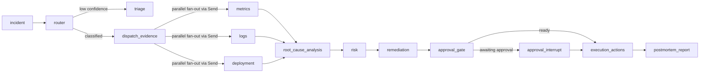

# SentinelOps AI

SentinelOps AI is an experimental uncertainty-aware incident reasoning system for infrastructure operations. It combines a FastAPI control plane, LangGraph-based orchestration, retrieval-grounded root-cause analysis, causal reasoning scaffolding, and a probabilistic evaluation framework to investigate operational incidents and propose remediations under strict operator control.

This repository is technically interesting because it tries to make incident analysis auditable rather than purely conversational: agent outputs are structured, root-cause reasoning is explicit, evaluation is reproducible, and safety and approval paths are built into the orchestration graph itself. It is not a finished autonomous SRE system.

---

## Current Project Status

The codebase has moved through a series of implementation phases visible in the source tree and test suite.

**Completed phases:**

- **Phase 39**: 106-incident labeled benchmark suite. Provides golden labels for classification, root cause, blast radius, remediation safety, and operator action.
- **Phase 40**: Evaluation integrity rewrite. The benchmark harness was corrected so golden labels are no longer injected into runtime agent outputs before scoring. This was a significant flaw in prior evaluation logic. All downstream scores before Phase 40 were inflated.
- **Phase 41**: Evidence grounding and hallucination suppression. Retrieval provenance tracking, citation checks, and topology/temporal validation exist in code and are covered by tests.
- **Phase 42**: Semantic operational memory and retrieval. Qdrant-backed vector stores and a hybrid retrieval orchestrator with topology-aware filtering and time-decay weighting are present.
- **Phase 43**: Causal reasoning scaffolding. Timed event construction, candidate cause generation, causal event graph, counterfactual scoring, propagation estimation, and narrative generation are implemented.
- **Phase 44**: Uncertainty-aware reasoning. `agents/uncertainty.py` exposes a full `UncertaintyEngine` that aggregates evidence quality, detects contradictions, scores calibration, distributes probability across competing hypotheses via temperature scaling, and recommends operator escalation when ambiguity is unsafe. The probabilistic root-cause path in `agents/rootcause_agent/probabilistic_reasoner.py` now uses this engine end to end.

**What is validated today:**

- The repository has a real backend runtime, a real orchestration graph, a real test suite, and a real benchmark harness.
- 761 tests collected across the full local test suite. CI only runs the unit and integration subsets.
- The deterministic replay framework is reproducible over the 106-incident benchmark suite. The replay hash `ddf715d1d54bba67` is a stable fingerprint of the benchmark suite structure (computed from incident IDs and suite metadata, not from reasoning outputs).
- Uncertainty-aware root-cause outputs, contradiction handling, escalation states, hypothesis probability distribution, and calibration scoring are covered by tests.

**What is still weak or experimental:**

- Semantic operational cognition is still weak. The system can structure evidence better than it can understand infrastructure deeply.
- Root-cause accuracy on the real evaluation path is extremely low (0.0820).
- Hallucination suppression exists but mostly enforces grounding and citation discipline rather than fixing reasoning quality.
- Autonomous execution is not production-ready. All high-risk operations require operator approval.
- Many evaluation components remain deterministic or simulated, not live.
- Several runtime integrations are stubs or dev-only connectors.
- Confidence calibration is poor, with systematic underconfidence.

---

## Architecture Overview

The repository is centered on a Python backend in `apps/api-server` and a small Next.js dashboard in `apps/web-dashboard`.

**Core backend components:**

- `FastAPI` — API surface for health, incidents, graph control, approvals, evaluations, and WebSocket streaming
- `LangGraph StateGraph` — deterministic orchestration of the incident pipeline
- `Celery` + `Redis` — background incident execution and scheduled tasks (replay, approval polling)
- `PostgreSQL` — persistent storage for incidents, agent executions, evidence items, approvals, remediation actions, postmortems, and workflow checkpoints
- `Qdrant` — vector store for runbooks, patterns, prevention items, incident history, and operational memory
- `Prometheus`, `Grafana`, `Loki`, `Tempo` — local observability stack
- Retrieval layer with topology-aware hybrid retrieval, provenance tracking, and consistency checks
- Causal root-cause path with timed events, candidate causes, probabilistic scoring, and uncertainty propagation
- Execution guardrails: tool allowlist, JWT approval tokens, risk-tier classification, and operating modes

**Orchestration graph** (`apps/api-server/src/orchestration/graphs/main_graph.py`):



The evidence collection step (`dispatch_evidence` → `metrics`, `logs`, `deployment`) uses LangGraph `Send` for parallel dispatch. All three evidence agents run concurrently and their outputs converge at `root_cause_analysis`.

**Important architectural constraints in code:**

- The live root-cause path consumes normalized evidence emitted by upstream agents. It does not directly query Prometheus, Loki, or GitHub.
- Retrieval grounds pattern matching and runbook lookup, not live telemetry collection.
- The approval gate is a node inside the orchestration graph — interrupt and resume are handled by LangGraph's `interrupt_before` mechanism, not by an API-side flag.
- Checkpoint persistence uses two parallel systems: a custom `WorkflowCheckpointStore` writes snapshots to PostgreSQL at each node boundary; a LangGraph `MemorySaver` handles in-process interrupt/resume. These serve different purposes — PostgreSQL provides durable recovery across restarts; `MemorySaver` is the active in-process checkpointer for LangGraph's interrupt/resume mechanism. Cross-process interrupt/resume requires `langgraph-checkpoint-postgres`, which is not installed by default.

---

## Operational Pipeline

### Live runtime path

```
POST /incidents/webhook
  → incident row created in PostgreSQL
  → Celery task enqueued to `incidents` queue
  → LangGraph graph invoked
  → router: LLM classification + incident history retrieval
  → dispatch_evidence: parallel fan-out
  → metrics / logs / deployment: evidence collection via tool-using agent_loop
  → root_cause_analysis:
      evidence normalization → timed events → candidate causes →
      probabilistic scoring → UncertaintyEngine assessment →
      escalation decision
  → risk: blast-radius estimation (topology traversal + traffic snapshot Monte Carlo)
  → remediation: risk-ranked action planning
  → approval_gate: interrupt if human approval required
  → execution_actions: guarded tool execution (allowlist + approval token validation)
  → postmortem_report: structured incident summary
```

**Runtime details that matter:**

- The router agent calls an LLM plus incident history retrieval from Qdrant.
- Metrics, logs, and deployment agents each run a generic `agent_loop` backed by tool-using LLM calls with mocked infrastructure connectors.
- Root-cause reasoning is mostly algorithmic once upstream evidence exists: it normalizes evidence, constructs timed events, generates candidate causes, scores them, and runs the `UncertaintyEngine`. The LLM is not directly involved in root-cause scoring.
- The `UncertaintyEngine` uses `calibration_temperature=1.35` and `escalation_threshold=0.55`. The temperature value is above 1.0, which systematically pushes calibrated probabilities toward 0.5 — this explains the high underconfidence rate observed in benchmark evaluation.
- Risk assessment uses topology traversal over a static service graph plus a Monte Carlo estimate (`random.Random(42)`, 1000 samples) over static traffic snapshots from `simulation/datasets/traffic_snapshots.json`.
- Remediation planning converts risk-ranked actions into approval-gated steps. It is currently shallow: action selection is conservative rather than semantically grounded.
- Execution is guarded by tool allowlists, JWT approval tokens scoped to specific incidents, and risk-tier enforcement.

### Simulated evaluation path

The evaluation path is intentionally separate from the runtime path:

- `evaluation/orchestration_runner.py` runs the pipeline over benchmark fixtures.
- Router, metrics, logs, and deployment agents execute real code paths but use mocked LLM clients (`evaluation/infra_mocks/mock_llm_client.py`) and mocked infrastructure responses.
- Root-cause, risk, and remediation logic then operate on those benchmark-derived outputs.
- No Celery tasks, no Slack notifications, no production telemetry queries, and no database mutations occur during evaluation.

This distinction is important. The evaluation harness proves that the code paths execute and produce scorable outputs — it does not prove that the system handles live incidents at operator-grade quality.

---

## Evaluation Philosophy

Evaluation is one of the stronger parts of the repository, primarily because the project explicitly corrected a major flaw.

**What was wrong before Phase 40:**

Earlier versions of the benchmark evaluation constructed agent outputs directly from golden labels before scoring them. This made downstream trustworthiness, hallucination, and calibration scores look better than the underlying reasoning deserved. Every metric produced before Phase 40 was invalidated by this label leakage.

**Phase 40 fix:**

The `evaluation/runner.py` was rewritten with an explicit contract:

- Golden labels are used only by scorers, never by agents.
- Runtime agent execution must not see golden labels.
- Actual outputs are compared against golden labels after execution.
- Deterministic replay remains reproducible independent of agent reasoning quality.

**Two distinct evaluation modes:**

**1. Real-code benchmark evaluation** (`evaluation/runner.py`)

- Loads `simulation/datasets/evaluation/benchmark_suite_v1.json`
- Calls `run_agent_pipeline()` over 106 incidents with mocked infrastructure
- Scores classification accuracy, root-cause text overlap, retrieval grounding, hallucination, blast radius, and remediation safety
- This path is more honest than the old version but still relies on mocked LLM responses for some agents

**2. Deterministic replay and regression tracking** (`evaluation/regression/benchmark_replay.py`)

- Computes scores from benchmark labels and scoring rules without invoking agents
- Produces a stable replay hash (`ddf715d1d54bba67`) as a fingerprint of the benchmark suite structure
- Feeds regression comparison logic in `regression_evaluator.py`
- **Important:** this path scores routing, calibration, remediation quality, execution safety, operator trust, and hallucination detection rates deterministically from benchmark metadata. It does not execute agent reasoning. It is more synthetic than the real-code benchmark path but more reproducible and useful for tracking calibration drift.

**Other evaluation components in code:**

- Calibration scoring: ECE, Brier score, temperature scaling, overconfidence/underconfidence rates, abstain thresholds
- Hallucination detection: citation checks against valid evidence keys
- Operator trust scoring
- Execution safety scoring
- Remediation quality scoring
- Retrieval grounding checks
- Benchmark regression comparison

---

## Current Evaluation Metrics

These are engineering diagnostics. They measure specific properties of the system under controlled conditions, not real-world incident handling quality.

### Real-code benchmark evaluation

Source: `evaluation/runner.py` over 106 benchmark incidents with mocked infrastructure

| Metric | Value | Interpretation |
|--------|-------|----------------|
| Root-cause accuracy | `0.0820` | Very low. The system often produces plausible but generic or weakly matched root-cause text. |
| Blast-radius score | `0.3861` | Partial match to benchmark expectations. The Monte Carlo model is simplistic. |
| Safety score | `0.7170` | Better, but does not justify autonomous execution. |
| Grounding score | `1.0000` | The root-cause path cites valid evidence keys. This does not mean conclusions are correct. |
| Classification accuracy | Benchmark-derived — see replay metrics. |

### Deterministic replay metrics

Source: `evaluation/regression/benchmark_replay.replay_benchmark()`

| Metric | Value |
|--------|-------|
| Replay hash | `ddf715d1d54bba67` |
| ECE (calibration error) | `0.2198` |
| Brier score | `0.1036` |
| Underconfidence rate | `0.8750` |
| Execution safety score | `0.7094` |
| Remediation mean quality score | `0.7670` |
| Hallucination detection rate | `0.1226` |

ECE of 0.2198 indicates poor calibration. The 87.5% underconfidence rate is consistent with `calibration_temperature=1.35` in the `UncertaintyEngine`, which systematically deflates top-hypothesis probabilities toward 0.5.

### Local validation snapshot

- Total tests collected: `761` (full local suite including unit, integration, chaos, orchestration, production, resilience, and evaluation tests)
- CI runs: `pytest apps/api-server/tests/unit apps/api-server/tests/integration` (subset only)
- Test files: `71`
- Benchmark suite: `106` incidents, version `1.0`

The main takeaway is not that the system is strong. The takeaway is that the repository can now measure several of its weaknesses reproducibly.

---

## Limitations

This section is intentionally blunt.

- **Semantic reasoning is still weak.** The system can structure evidence and enforce citation discipline better than it can understand infrastructure deeply. Root-cause attribution often matches surface patterns rather than actual causality.
- **Root-cause accuracy is extremely low** (0.0820 on the real benchmark path). The system produces plausible hypotheses that fail to match golden labels. This is the core unsolved problem.
- **Blast-radius modeling is simplistic.** It uses topology graph traversal over a static service graph plus a Monte Carlo simulation seeded at `random.Random(42)` with 1000 samples over static `traffic_snapshots.json`. No live traffic data is used.
- **Evaluation is still partially deterministic and partially simulated.** Several benchmark paths rely on mocked LLM responses. The deterministic replay computes scores without running agent reasoning at all.
- **Router quality in replay-style evaluation is much easier than real production classification** and should not be interpreted as deployment readiness.
- **LangGraph durable checkpointing is not configured end to end.** The default is `MemorySaver` (in-process only). Cross-process interrupt/resume requires `langgraph-checkpoint-postgres`, which is not installed by default. The custom `WorkflowCheckpointStore` writes PostgreSQL snapshots for crash recovery but is separate from LangGraph's interrupt mechanism.
- **No production-scale validation.** There is no demonstrated multi-cluster runtime, no live operator adoption evidence, and no load-tested incident volume in the repository.
- **No learned causal inference.** The root-cause engine is heuristic and rule-driven. Candidate causes are generated from topology + evidence type matching, not from learned causal models.
- **Retrieval grounding is still heuristic-heavy.** Qdrant, provenance tracking, and consistency checks help, but they do not create real operational understanding. Grounding score of 1.0 means citations are formally valid, not that they are causally meaningful.
- **Confidence calibration is poor,** particularly underconfidence. ECE is 0.2198 with 87.5% of benchmark incidents classified as underconfident.
- **Remediation planning is template-like.** Action selection is conservative (prefer safer actions) rather than semantically grounded in the incident specifics.
- **Autonomous execution is not ready.** High-risk operations, ambiguous incidents, low confidence, and missing telemetry all correctly route to operator escalation. This is working as intended — autonomous execution is explicitly disabled for these cases.
- **Several runtime integrations are dev connectors.** Slack, PagerDuty, Confluence, and GitHub integrations exist in code under `apps/api-server/src/tools/` but are constrained local/dev connectors rather than production-hardened integrations.
- **Live telemetry cognition is immature.** The metrics, logs, and deployment agents run through a generic tool-using loop that currently exercises mocked infrastructure in benchmarks, not live Prometheus/Loki/GitHub queries.

---

## Repository Structure

```text
.
├── apps
│   ├── api-server
│   │   ├── src
│   │   │   ├── agents              # router, metrics, logs, deployment, rootcause,
│   │   │   │                       # risk, remediation, postmortem agents +
│   │   │   │                       # uncertainty.py (UncertaintyEngine)
│   │   │   ├── api                 # FastAPI routes: incidents, approvals, graph,
│   │   │   │                       # evaluations, health
│   │   │   ├── causality           # causal event graph, counterfactual scoring,
│   │   │   │                       # propagation estimator, narrative generator
│   │   │   ├── core                # config, LLM client, resilience, operating modes
│   │   │   ├── db                  # models, repositories, session, migrations
│   │   │   ├── evaluation          # runner, benchmark suite, deterministic replay,
│   │   │   │                       # scorers, hallucination checks, infra mocks
│   │   │   ├── memory              # short-term incident state (Redis), long-term
│   │   │   │                       # operational memory (Qdrant)
│   │   │   ├── observability       # Prometheus metrics definitions, structured
│   │   │   │                       # logging, OpenTelemetry tracing
│   │   │   ├── orchestration       # LangGraph graph, nodes, state, checkpointing,
│   │   │   │                       # edges, interrupt/resume commands
│   │   │   ├── retrieval           # hybrid retrieval, embeddings, provenance,
│   │   │   │                       # consistency checker, runbook/incident stores
│   │   │   ├── tools               # execution guard, tool allowlist, risk classifier,
│   │   │   │                       # Slack, PagerDuty, GitHub, Prometheus, Loki tools
│   │   │   └── workers             # Celery app, task queues, incident pipeline tasks
│   │   ├── tests
│   │   │   ├── unit                # agent unit tests, causality, evaluation,
│   │   │   │                       # retrieval, orchestration, tools, middleware
│   │   │   ├── integration         # approval flow, incident webhook, security, routes
│   │   │   ├── evaluation          # benchmark suite, regression, calibration tests
│   │   │   ├── chaos               # broker outage, crash recovery, state corruption
│   │   │   ├── orchestration       # async stability, concurrency, worker recovery
│   │   │   ├── production          # infrastructure resilience, observability, security
│   │   │   ├── resilience          # circuit breaker, degraded execution, provider chain
│   │   │   └── load                # Locust load test script (not collected by pytest)
│   │   ├── Dockerfile
│   │   └── requirements.txt
│   └── web-dashboard               # Next.js dashboard for incidents, approvals,
│                                   # traces, and evaluation results
├── configs
│   ├── development
│   ├── evaluation
│   ├── production                  # tool_allowlist.yaml, postmortem template
│   └── staging
├── docs
│   ├── adr                         # architecture decision records
│   ├── architecture                # current, target, and overview docs
│   ├── api-specs
│   └── runbooks
├── infrastructure
│   ├── docker                      # Prometheus, Grafana, Loki, Tempo, Postgres configs
│   ├── monitoring
│   └── render.yaml
├── scripts
│   ├── demo
│   ├── migrations
│   ├── seed
│   └── setup
├── simulation
│   ├── datasets                    # benchmark_suite_v1.json (106 incidents),
│   │                               # traffic_snapshots.json, historical_incidents.csv
│   ├── incident-generators
│   └── mock-services
├── docker-compose.yml
├── docker-compose.simulation.yml
├── Makefile
└── pyproject.toml
```

---

## Local Development

### Prerequisites

- Python `3.11+`
- Node `20+`
- Docker and Docker Compose
- An OpenAI-compatible or Ollama-compatible LLM endpoint to exercise live agent paths (optional for evaluation-only use)

### Environment setup

```bash
cp .env.example .env
# Edit .env to set database credentials, LLM endpoint, and auth secrets
```

Key environment variable groups:

- PostgreSQL, Redis, and Qdrant connection strings
- Prometheus, Grafana, Loki, and Tempo URLs
- LLM endpoint (`OPENAI_BASE_URL`, `OPENAI_API_KEY` or Ollama equivalent)
- Auth and approval token secrets (`API_SECRET_KEY`, `APPROVAL_TOKEN_SECRET`)
- Tool allowlist path (`TOOL_ALLOWLIST_PATH`)

### Start the full local stack

```bash
docker compose up --build
# or
make dev
```

This brings up: `api-server`, `celery-worker`, `celery-beat`, `web-dashboard`, `postgres`, `redis`, `qdrant`, `prometheus`, `grafana`, `loki`, `tempo`.

Service ports: API on `8000`, dashboard on `3001`, Grafana on `3000`, Prometheus on `9090`, Qdrant on `6333`.

Optional simulation services (mock payment, auth, gateway services):

```bash
docker compose -f docker-compose.simulation.yml up --build
# or
make simulate-up
```

### Run tests

```bash
pip install -e ".[dev]"
ruff check apps/api-server/src apps/api-server/tests
pytest                          # full suite: 761 tests
pytest apps/api-server/tests/unit apps/api-server/tests/integration   # CI subset
```

### Run the benchmark evaluation

Via API (requires running stack):

```bash
GET /evaluations/summary
```

Directly without a running stack:

```bash
PYTHONPATH=apps/api-server/src python -c \
  "from evaluation.runner import run_evaluation; import asyncio, json; \
   print(json.dumps(asyncio.run(run_evaluation()), indent=2))"
```

### Run deterministic replay

```bash
PYTHONPATH=apps/api-server/src python - <<'PY'
from evaluation.benchmark_suite import load_benchmark_suite
from evaluation.regression.benchmark_replay import replay_benchmark
import json
result = replay_benchmark(load_benchmark_suite())
print(json.dumps(result.to_dict(), indent=2))
PY
```

### Replay pending incidents (Celery)

```bash
make replay-pending
```

### Operational demo

A basic demo checklist is in `scripts/demo/run_demo.sh`. The dashboard is available at `http://localhost:3001` when the compose stack is running.

---

## Safety Model

The repository contains a real safety model. It is incomplete for production autonomous operation but is not just a flag.

**Key components:**

| Component | Location |
|-----------|----------|
| Tool allowlist | `configs/production/tool_allowlist.yaml` |
| Execution guard | `tools/execution_guard.py` |
| JWT approval tokens | `tools/execution_guard.py` (`create_approval_token`, `decode_approval_token`) |
| Risk-tier classification | `tools/risk_classifier.py` |
| Operating mode management | `core/resilience/operating_mode.py` |
| Execution blocking in graph | `orchestration/nodes/execution_node.py` |
| Uncertainty-aware escalation | `agents/uncertainty.py` (`UncertaintyEngine._build_escalation`) |

**Dangerous tools in allowlist** (require approval token): `rollback_deployment`, `restart_service`, `scale_service`.

**Operating modes:**

| Mode | LLM calls | Automated actions |
|------|-----------|-------------------|
| `FULL` | yes | yes |
| `DEGRADED` | yes (secondary provider) | yes |
| `LOCAL_ONLY` | yes (Ollama) | yes |
| `SAFE_MODE` | no | no |
| `OBSERVE_ONLY` | — | no |

Modes transition automatically on provider failure and are visible in graph state and API responses.

**Escalation triggers from the uncertainty engine:**

- `low_confidence` — calibrated confidence below 0.55
- `conflicting_evidence` — evidence contradictions detected
- `weak_retrieval_grounding` — grounding score below 0.50
- `high_blast_radius` — incident severity is `critical`, `sev1`, or `high`
- `insufficient_telemetry` — two or more telemetry types missing
- `unknown_cause` — low confidence and low hypothesis stability combined

When escalation is recommended, the remediation planning node routes to the approval gate regardless of risk tier. Execution is blocked until a human approves.

**Why autonomous execution is still restricted:**

Root-cause accuracy of 0.0820 means the system is wrong far more often than it is right on the benchmark path. Safety score of 0.7170 is insufficient to trust automated remediation actions on live infrastructure. The operator approval path is the correct default.

---

## CI/CD and Infrastructure Reality

**What exists:**

- GitHub Actions CI (`.github/workflows/ci.yml`): Ruff linting, backend unit and integration tests, frontend build, and a basic evaluation count check on every push to `main` and on every PR
- Separate evaluation workflow (`.github/workflows/evaluation.yml`): runs full evaluation summary with minimal dependencies
- Dockerfiles for API and dashboard
- Docker Compose for local full-stack runtime
- Render manifest in `infrastructure/render.yaml`

**What does not exist yet:**

- A publish step in the deploy pipeline. `.github/workflows/deploy.yml` builds Docker images on `main` pushes but does not push them to a registry or deploy them anywhere.
- Durable LangGraph checkpointing configured end to end. `langgraph-checkpoint-postgres` is not in `pyproject.toml`.
- A demonstrated production environment using the full stack.
- Load test results or multi-service chaos validation at meaningful scale.

---

## Roadmap

The credible next steps are bottlenecks in the current evaluation numbers, not feature additions:

- **Root-cause specificity**: reduce generic hypothesis text; improve evidence-to-cause mapping beyond keyword proximity
- **Learned causality**: replace heuristic candidate generation with statistically grounded or learned causal inference
- **Live telemetry grounding**: move metrics, logs, and deployment agents from mocked responses toward real Prometheus/Loki/GitHub connectors
- **Confidence calibration**: improve ECE; address the systematic underconfidence introduced by `calibration_temperature=1.35`
- **Blast-radius estimation**: replace static traffic snapshots with live or recently sampled traffic data; improve topology modeling
- **Operator feedback loops**: capture real operator override decisions and feed them back into retrieval and calibration
- **Durable checkpointing**: add `langgraph-checkpoint-postgres` to enable cross-process interrupt/resume without depending on the custom PostgreSQL snapshot fallback
- **Semantic blast-radius estimation**: understand which downstream services are actually affected by a given failure mode, not just topologically reachable
- **Evaluation coverage**: reduce reliance on mocked LLM responses in benchmark paths; increase coverage of live code paths

---

## Why This Repository Is Worth Reading

SentinelOps is most useful as a research and engineering reference, not as a finished platform. It is a reasonable study subject if you want to see:

- how to separate orchestration from evaluation so scores reflect actual reasoning quality
- how to build operator-in-the-loop approval into an agent orchestration graph
- how to add uncertainty quantification and calibration to a reasoning pipeline without overstating confidence
- how to structure a benchmark harness that avoids golden label leakage
- how to represent operating-mode degradation in a multi-provider LLM system

It is less useful if you need proven autonomous operations software today.

---

## License

[MIT](LICENSE)
