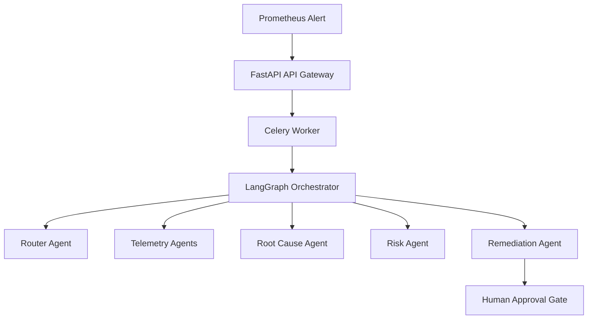

# SentinelOps

[](https://github.com/purvanshh/SentinelOps/actions/workflows/ci.yml)
[](https://codecov.io/gh/purvanshh/SentinelOps)

**Autonomous multi-agent incident response and reliability orchestration platform.** SentinelOps ingests alerts from Prometheus, correlates signals across metrics, logs, traces, and deployments, then drives a LangGraph-based agent crew to investigate, diagnose, and propose remediations — all gated by human approval.

## Architecture



The system is composed of:

- **FastAPI API Gateway** — Webhook ingestion, incident tracking, approval workflows, Prometheus metrics
- **LangGraph Orchestrator** — State-machine driven agent coordination with causal reasoning and counterfactual validation
- **Agent Crew** — Specialized agents for metrics, logs, deployments, root-cause analysis, risk scoring, and remediation planning
- **Knowledge Layer** — Historical incident memory, pattern retrieval (Qdrant), knowledge graphs, and runbook generation
- **Observability Stack** — Prometheus + Grafana for metrics, Loki for logs, Tempo for traces
- **Worker Pool (Celery)** — Async execution of long-running investigation workflows with Redis broker
- **Web Dashboard** — Next.js frontend for real-time incident visibility and operator approvals

## Quickstart

```bash
git clone https://github.com/purvanshh/SentinelOps.git
cd SentinelOps
cp .env.example .env
make up
curl http://localhost:8000/health
```

See [docs/getting-started.md](docs/getting-started.md) for detailed setup, including prerequisites and service endpoints.

## Project Status

| Metric | Target | Current | Status |
| :--- | :--- | :--- | :--- |
| Root Cause Match (top-1) | >75% | 11.93% / 14.68% | Warning |
| Classification Accuracy | >90% | 99.17% | Passing |
| Evidence Grounding Score | >0.95 | 0.984 | Passing |

SentinelOps is under active development. Autonomy is currently disabled — human supervision is required for all remediation actions. See [docs/architecture/current.md](docs/architecture/current.md) for details on the current architecture and [docs/architecture/target-architecture.md](docs/architecture/target-architecture.md) for the planned evolution.

## Development

```bash
make dev        # Start all services (api, workers, db, observability stack)
make test       # Run unit tests
make logs       # Tail service logs
make api-shell  # Open a shell in the API container
```

## Documentation

- [Getting Started](docs/getting-started.md)
- [Architecture Overview](docs/architecture/overview.md)
- [Current Architecture](docs/architecture/current.md)
- [Target Architecture](docs/architecture/target-architecture.md)
- [Demo Script](docs/demo-script.md)
