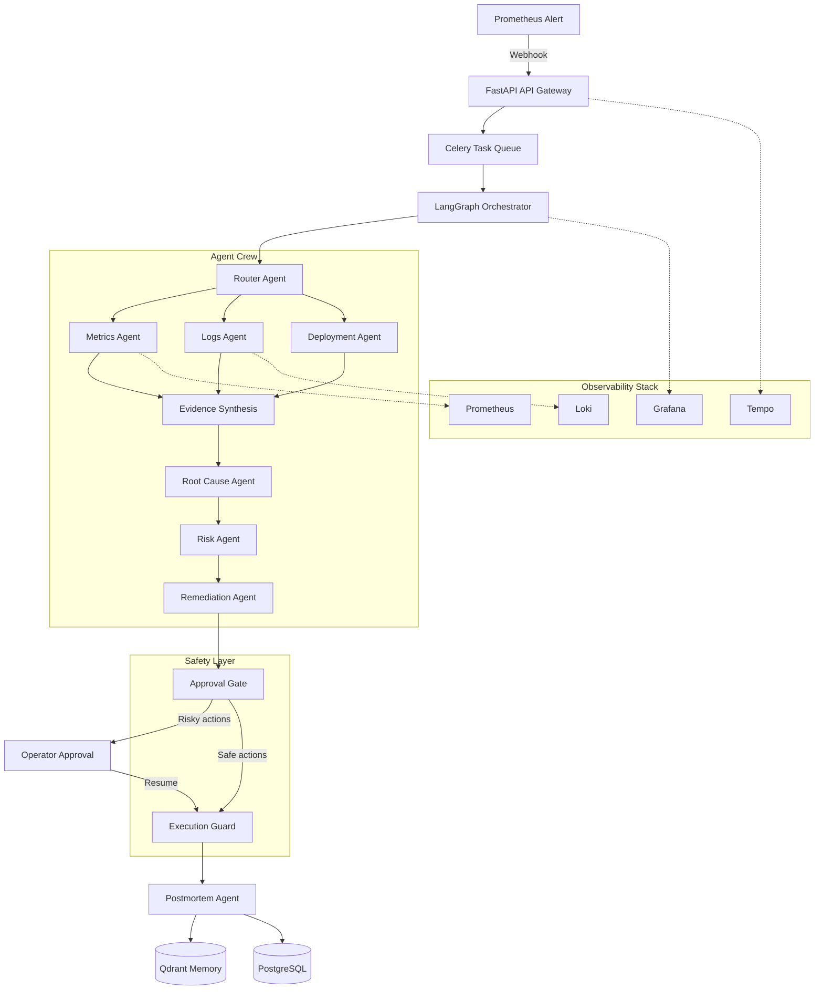

# SentinelOps

[](https://github.com/purvanshh/SentinelOps/actions/workflows/ci.yml)
[](https://codecov.io/gh/purvanshh/SentinelOps)
[](LICENSE)
[](pyproject.toml)
[](apps/web-dashboard/package.json)

**Autonomous multi-agent incident response and reliability orchestration platform.** SentinelOps ingests alerts from Prometheus, correlates signals across metrics, logs, traces, and deployments, then drives a LangGraph-based agent crew to investigate, diagnose, quantify risk, and propose remediations — all gated by human approval for safety-critical actions.

## Overview

- **Purpose** — Reduce MTTR (Mean Time to Resolution) by automating the investigative and diagnostic phases of incident response, while keeping humans in the loop for remediation decisions.
- **Problem it solves** — Production incidents produce a flood of telemetry across multiple observability tools. Engineers spend hours correlating signals, tracing causal chains, estimating blast radius, and writing postmortems. SentinelOps automates the cognitive loop that SREs follow: gather evidence, form hypotheses, validate against constraints, quantify risk, and propose actions.
- **Target users** — SRE teams, platform engineers, and incident responders operating at scale.
- **Current status** — **In Development** (pre-production). Core agent pipeline and evaluation framework are functional. Autonomy is disabled by default; human supervision is required for all remediation actions.

## Features

### Implemented

- **Alert ingestion** — Prometheus webhook receiver creates structured incidents with automatic classification
- **Multi-agent investigation pipeline** — Specialized agents for metrics (Prometheus), logs (Loki), deployments (GitHub), and dependency topology
- **Router agent** — Classifies incidents by type, severity, and urgency using LLM with few-shot examples
- **Root cause analysis** — Multi-phase pipeline: evidence normalization, knowledge graph construction, LLM-based candidate generation, counterfactual validation, probabilistic reasoning with uncertainty quantification
- **Causal reasoning engine** — Rule-based and learned Bayesian causality with graph path search
- **Knowledge graph** — Temporal, structural, and topological evidence graph with BFS-based causal traversal
- **Autonomous investigation planner** — Iterative hypothesis refinement with Bayesian confidence updates and specialist agent orchestration
- **Dynamic runbook generation** — Mechanism-specific templates (deployment error, resource exhaustion, configuration drift, dependency failure, cascade failure) with structured diagnosis/fix/rollback/verification phases
- **Risk assessment** — Blast radius computation via service topology, remediation risk scoring against historical success data
- **Remediation planning** — Actionable step-by-step plans with approval gates for dangerous operations
- **Human approval workflow** — JWT-secured approval tokens, timed expiry, auto-rejection for unapproved actions, WebSocket incident streaming
- **Operator feedback loop** — Stores acceptance/rejection/modification patterns, learns mechanism remappings and confidence adjustments
- **Organizational knowledge graph** — Encodes team-service ownership, known risks, and common failure modes
- **Evidence quality scoring** — Multi-dimensional scoring (type, severity, z-score, specificity, frequency) with noise filtering
- **Root cause ranking engine** — 7-dimensional composite scoring: evidence coverage, counterfactual success, historical similarity, graph consistency, repository consistency, temporal consistency, hypothesis stability
- **Postmortem generation** — 5-whys analysis, structured timeline, incident metrics (TTD/TTM/TTR), versioned markdown output indexed into Qdrant
- **Memory system** — 6 Qdrant-backed vector stores for incident, remediation, deployment, topology, noisy-alert, and escalation patterns with multi-dimensional re-ranking
- **Counterfactual validation** — Validates candidates against expected telemetry signatures for known failure mechanisms
- **LangGraph orchestration** — 13-node state machine with Redis + PostgreSQL checkpointing, interrupt/resume for approvals, provider-level resilience with multi-LLM failover
- **Evaluation framework** — 106-benchmark suite with real agent execution against mocked infrastructure, lexical + semantic scoring, hallucination detection, safety classification
- **Observability** — OpenTelemetry tracing, Prometheus metrics, structlog structured logging, Grafana dashboards
- **Tool execution safety** — Three-layer execution guard (allowlist, approval tokens, audit logging) with risk tier classification
- **Celery background workers** — Async pending task processing with heartbeat monitoring and dead-letter recovery
- **Web dashboard** — Next.js 14 frontend for incident visibility, approval management, and evaluation results
- **E2E / integration test suites** — Testcontainers-based integration tests, Docker Compose E2E environment, Playwright web E2E

### Planned / Under Development

- Full production deployment configuration (Kubernetes manifests and Terraform scripts are scaffolding only)
- Multi-region replication and high-availability mode
- Advanced learning from operator feedback (continuous model fine-tuning)
- Runbook automation execution (currently generates runbooks but does not auto-execute kubectl/API commands)
- Real-time collaboration features for incident response

## Tech Stack

| Category | Technologies |
|---|---|
| **Backend** | Python 3.11, FastAPI 0.115, Uvicorn, Celery 5.4 |
| **Frontend** | Next.js 14, React 18, TypeScript 5 |
| **Database** | PostgreSQL 15.6 (primary), Redis 7.2 (cache/queue), Qdrant 1.9 (vectors) |
| **AI/ML** | LangGraph 0.2.34, OpenAI-compatible LLMs (primary/secondary/local fallback), sentence-transformers, NumPy |
| **Orchestration** | LangGraph state machine, Celery workers, Redis broker |
| **Observability** | OpenTelemetry, Prometheus, Grafana, Loki, Tempo |
| **Authentication** | Auth0 (JWT with RS256/HS256), python-jose, RBAC middleware |
| **Infrastructure** | Docker Compose, Render (PaaS), GitHub Actions |
| **Testing** | pytest, pytest-asyncio, testcontainers, respx, Playwright, Locust |
| **Linting/Formatting** | Ruff, Black, Flake8, MyPy, pre-commit hooks |
| **Package Manager** | pip (Python), npm (Node.js workspaces) |

## Architecture

SentinelOps uses a **cooperative multi-agent architecture** orchestrated by a LangGraph state machine. The system is not a linear workflow — it is a stateful, tool-augmented reasoning engine that mimics expert SRE investigation patterns.



### Request Flow

1. **Alert arrives** — Prometheus Alertmanager sends a webhook to `POST /incidents/webhook`
2. **Incident created** — API validates and stores the incident in PostgreSQL, enqueues a Celery task
3. **Worker picks up** — Celery worker invokes the LangGraph workflow with the incident ID
4. **Router classifies** — Router agent determines incident type, severity, and investigation priority
5. **Evidence gathering** — Metrics, logs, and deployment agents query their respective data sources in parallel
6. **Evidence synthesis** — Correlation agent builds a unified timeline and knowledge graph
7. **Root cause analysis** — Candidate generation → counterfactual validation → probabilistic scoring with uncertainty
8. **Risk assessment** — Blast radius computation + remediation action risk scoring
9. **Remediation planning** — Structured step-by-step plan with approval requirements
10. **Approval gate** — If dangerous actions exist, workflow pauses and awaits operator decision via WebSocket or polling
11. **Execution** — Approved actions execute through the tool registry with safety guard enforcement
12. **Postmortem** — Final report generated and indexed into vector memory for future retrieval

### Services

| Service | Role |
|---|---|
| `api-server` | FastAPI application serving REST APIs and WebSocket streams |
| `celery-worker` | Background worker processing LangGraph workflows and pending tasks |
| `celery-beat` | Scheduled task dispatcher for periodic evaluations and maintenance |
| `web-dashboard` | Next.js frontend for operators |
| `postgres` | Primary database for all persistent state |
| `redis` | Celery broker, runtime state cache, LLM response cache |
| `qdrant` | Vector database for similarity search across patterns, incidents, runbooks |
| `prometheus` | Metrics collection and query backend for agent investigations |
| `grafana` | Visualization dashboards for incident metrics |
| `loki` | Log aggregation backend for log agent queries |
| `tempo` | Distributed tracing backend |

## Folder Structure

```
.
├── apps/
│   ├── api-server/               # FastAPI backend
│   │   ├── src/
│   │   │   ├── agents/           # Agent implementations (router, metrics, logs, RCA, risk, remediation, postmortem)
│   │   │   ├── api/              # REST routes, middleware, schemas, WebSocket
│   │   │   ├── causality/        # Causal reasoning engine (rule-based + Bayesian)
│   │   │   ├── core/             # Config, LLM client, exceptions, utilities
│   │   │   ├── correlation/      # Multi-incident correlation engine
│   │   │   ├── db/               # SQLAlchemy models, migrations, repositories
│   │   │   ├── evaluation/       # Benchmark suite, scorers, hallucination detection, orchestration runner
│   │   │   ├── execution/        # Remediation execution layer
│   │   │   ├── feedback/         # Operator feedback store, organizational knowledge graph
│   │   │   ├── ingestion/        # Alert ingestion pipelines
│   │   │   ├── investigation/    # Autonomous planner, runbook generator
│   │   │   ├── knowledge/        # Evidence knowledge graph (schema, builder, query, storage)
│   │   │   ├── learning/         # Self-critic, feedback engine, trust model, calibration tracker
│   │   │   ├── memory/           # Qdrant-backed operational memory (6 stores), short-term caches
│   │   │   ├── observability/    # Metrics definitions, reality monitoring, diagnostics
│   │   │   ├── operators/        # Operator workflow definitions
│   │   │   ├── orchestration/    # LangGraph state machine, nodes, callbacks, checkpointing
│   │   │   ├── replay/           # Telemetry replay engine
│   │   │   ├── repo/             # Git analyzer, code ownership, dependency graph
│   │   │   ├── retrieval/        # Hybrid retriever, pattern store, consistency checker
│   │   │   ├── runtime/          # Runtime context, readiness checks, tool runtime
│   │   │   ├── scoring/          # Evidence quality scoring, ranking engine
│   │   │   ├── semantics/        # Semantic engine, ontology, contradiction detection
│   │   │   ├── tools/            # Tool registry, execution guard, infra clients (Prometheus, Loki, GitHub, Slack)
│   │   │   ├── validation/       # Input/output validation
│   │   │   ├── verification/     # Counterfactual validator, expectation library
│   │   │   ├── workers/          # Celery task definitions
│   │   │   └── main.py           # FastAPI application entry point
│   │   └── tests/                # Unit, integration, e2e, evaluation test suites
│   │       ├── unit/
│   │       ├── integration/
│   │       ├── e2e/
│   │       └── evaluation/
│   └── web-dashboard/            # Next.js 14 operator dashboard
│       ├── src/app/              # App router pages (incidents, approvals, evaluations)
│       ├── src/components/       # React components
│       ├── src/services/         # API client services
│       └── src/store/            # State management
├── configs/                      # Topology, patterns, weights, tool allowlist per environment
│   ├── development/
│   ├── production/
│   └── evaluation/
├── docs/                         # Architecture, ADRs, PRD, runbooks, research, security docs
├── infrastructure/               # Docker configs, Kubernetes, Terraform, monitoring dashboards
│   ├── docker/                   # Per-service configs (prometheus, grafana, loki, tempo, postgres)
│   ├── kubernetes/               # Placeholder for K8s manifests
│   └── terraform/                # Placeholder for Terraform scripts
├── scripts/                      # Bootstrap, demo, migration, seed scripts
├── sentinel-common/              # Shared Python package (interfaces, DTOs, events, telemetry)
├── sentinel-eval/                # Evaluation package (benchmarks, calibration, red team)
├── sentinel-runtime/             # Runtime package (agents, orchestration, safety, tools)
├── sentinel-sim/                 # Simulation package (environments, generators, traffic injection)
├── sentinel-ui/                  # Standalone UI package
└── simulation/                   # Datasets, incident generators, mock services for testing
    ├── datasets/evaluation/      # 106-benchmark suite (benchmark_suite_v1.json)
    ├── incident-generators/      # Scenario generators (bad_deployment, cpu_spike, memory_leak, etc.)
    └── mock-services/            # Mock external services for E2E testing
```

## Getting Started

### Prerequisites

- Docker and Docker Compose (for full stack)
- Python 3.11+
- Node.js 20+

### Installation

```bash
# Clone the repository
git clone https://github.com/purvanshh/SentinelOps.git
cd SentinelOps

# Copy environment variables
cp .env.example .env

# Build and start all services
make up
```

The API will be available at `http://localhost:8000`. See [docs/getting-started.md](docs/getting-started.md) for detailed setup.

### Configuration

Configuration is managed through environment variables (see `.env.example` for the full reference). Key settings groups:

| Group | Key Variables | Description |
|---|---|---|
| **App** | `APP_ENV`, `API_PORT`, `API_RATE_LIMIT` | Runtime environment and API configuration |
| **Database** | `POSTGRES_*` | PostgreSQL connection details |
| **Redis/Qdrant** | `REDIS_URL`, `QDRANT_URL` | Cache, broker, and vector store URLs |
| **LLM** | `LLM_PROVIDER`, `LLM_BASE_URL`, `LLM_API_KEY`, `LLM_MODEL` | Primary LLM provider (OpenAI-compatible) |
| **LLM Fallback** | `LLM_SECONDARY_*`, `NVIDIA_*`, `LLM_LOCAL_*` | Resilient provider chain (secondary, NVIDIA, local) |
| **Auth** | `AUTH0_*`, `APPROVAL_TOKEN_SECRET` | JWT authentication and approval security |
| **Observability** | `PROMETHEUS_URL`, `LOKI_URL`, `TEMPO_URL` | Telemetry backend endpoints |
| **Integrations** | `GITHUB_TOKEN`, `SLACK_WEBHOOK_URL` | External service tokens |

### Running with Docker

```bash
# Full production-like stack
make up

# Individual services for development
make dev

# Start simulation mock services
make simulate-up
```

### Running Locally (without Docker)

```bash
# Backend
cd apps/api-server
pip install -e ".[dev]"
uvicorn main:app --reload

# Frontend
cd apps/web-dashboard
npm install
npm run dev
```

## Usage

### Incident Investigation Workflow

1. **Send an alert** — Configure Prometheus Alertmanager to POST to `http://<host>:8000/incidents/webhook`
2. **Monitor progress** — View the investigation in the web dashboard at `http://localhost:3001` or via the WebSocket stream
3. **Review findings** — Once the investigation completes, review the root cause analysis, risk assessment, and remediation plan
4. **Approve remediations** — For risky actions, approve or reject via the dashboard or API
5. **Read postmortem** — After resolution, access the auto-generated postmortem report

### Example Commands

```bash
# Health check
curl http://localhost:8000/health

# List incidents
curl http://localhost:8000/incidents

# Simulate an alert
curl -X POST http://localhost:8000/incidents/webhook \
  -H "Content-Type: application/json" \
  -H "Authorization: Bearer <jwt>" \
  -d '{
    "title": "High error rate on payment-api",
    "source": "prometheus",
    "severity": "critical",
    "service": "payment-api",
    "summary": "Error rate > 5% for 5 minutes"
  }'

# Get incident trace
curl http://localhost:8000/incidents/{incident_id}/trace

# List pending approvals
curl http://localhost:8000/approvals

# Approve a remediation
curl -X POST http://localhost:8000/approvals/{incident_id} \
  -H "Authorization: Bearer <jwt>" \
  -d '{"approved": true, "note": "Proceed with rollback"}'

# Run evaluation suite
curl http://localhost:8000/evaluations/summary
```

## API Documentation

The API is documented via automatically generated OpenAPI specs at `http://localhost:8000/docs` when running.

### Routes

| Method | Path | Description | Auth |
|---|---|---|---|
| `GET` | `/health` | Service health (Redis, Qdrant, provider chain) | None |
| `GET` | `/metrics` | Prometheus-formatted metrics | None |
| `POST` | `/incidents/webhook` | Ingest alert and create incident | Admin |
| `GET` | `/incidents` | List incidents (optional `status_filter`) | Authenticated |
| `GET` | `/incidents/{id}` | Get incident with runtime state | Authenticated |
| `POST` | `/incidents/{id}/classify` | Trigger router re-classification | Operator |
| `GET` | `/incidents/{id}/postmortems` | List postmortems for incident | Authenticated |
| `POST` | `/incidents/{id}/start` | Boot LangGraph investigation | Operator |
| `POST` | `/incidents/{id}/resume` | Resume from approval interrupt | Operator |
| `GET` | `/incidents/{id}/state` | Current graph state | Authenticated |
| `GET` | `/incidents/{id}/graph-state` | Visual graph node statuses | Authenticated |
| `GET` | `/incidents/{id}/trace` | Full incident trace | Authenticated |
| `GET` | `/approvals` | List pending approvals | Operator |
| `POST` | `/approvals/{incident_id}` | Approve/reject remediation | Operator |
| `GET` | `/evaluations/summary` | Run evaluation suite, return scores | Admin |
| `POST` | `/auth/refresh` | Refresh authentication token | Authenticated |
| `POST` | `/auth/revoke` | Revoke authentication token | Authenticated |
| `WS` | `/ws/incidents/{id}/stream` | Stream incident state updates | Authenticated |

### Authentication

All endpoints except `/health` and `/metrics` require a JWT Bearer token in the `Authorization` header. Tokens are validated against the configured Auth0 domain with RS256/HS256 signature verification. The RBAC system supports three roles:

- **viewer** — Read access to incidents and evaluations
- **operator** — Can start investigations, approve remediations, classify incidents
- **admin** — Full access including alert ingestion

## Development

### Commands

```bash
# Run all tests (requires running services)
make test

# Run specific test categories (from apps/api-server)
pytest -m unit          # Unit tests (fast, no dependencies)
pytest -m integration   # Integration tests (requires Postgres/Redis)
pytest -m e2e           # End-to-end tests (requires full stack)
pytest -m evaluation    # Benchmark evaluation tests

# Lint and format
ruff check apps/api-server/src apps/api-server/tests
ruff check apps/api-server/src apps/api-server/tests --fix
black --check apps/api-server/src apps/api-server/tests

# Type check
mypy apps/api-server/src/core/config.py apps/api-server/src/core/llm_client.py

# View logs
make logs

# Open API shell
make api-shell
```

### Pre-commit Hooks

The repository includes pre-commit hooks for Ruff linting/formatting, trailing whitespace, YAML validation, and Bandit security scanning. Install with:

```bash
pre-commit install
```

### CI/CD Pipeline

| Workflow | Trigger | Steps |
|---|---|---|
| **CI** | PR + push to main | Ruff, Flake8, MyPy, pytest (unit with coverage), evaluation summary |
| **E2E** | Nightly / manual | Spin up E2E Docker stack, seed DB, run E2E tests, teardown |
| **Integration** | Nightly / manual | Run pytest integration suite |
| **Evaluation** | PR + push to main | Run full evaluation benchmark and output scores |
| **Deploy** | Push to main | Build and push Docker images (Render targets) |

## Deployment

### Current Deployment Target

SentinelOps is configured for deployment on [Render](https://render.com) via `infrastructure/render.yaml`. Two services are defined:

- **sentinelops-api** — Docker-based web service from `apps/api-server/Dockerfile`
- **sentinelops-web** — Docker-based web service from `apps/web-dashboard/Dockerfile`

### Production Configuration

Before deploying:

1. Set `APP_ENV=production` — enables production validation and secret checks
2. Replace all default secrets with strong, managed credentials
3. Configure an external PostgreSQL, Redis, and Qdrant instance
4. Set up Prometheus, Loki, and Tempo endpoints
5. Configure Auth0 with proper RS256 signing keys
6. Review and populate `configs/production/tool_allowlist.yaml` for execution safety

**Note:** Kubernetes manifests (`infrastructure/kubernetes/`) and Terraform scripts (`infrastructure/terraform/`) are currently scaffolding with no implementation. Production-grade orchestration setup requires completion.

## Known Issues & Technical Debt

- **Root cause accuracy** — Current lexical match accuracy is ~11.9%, semantic ~14.7%. Primary gap is in causal inference quality and evidence sufficiency. Active area of development.
- **Kubernetes/Terraform** — Infrastructure-as-code directories are scaffolding only and not functional.
- **Database migrations** — `db/migrations/` directory is empty; the system uses SQLAlchemy `create_all` for schema initialization. Migrations are not version-controlled.
- **Auth endpoints** — `/auth/refresh` and `/auth/revoke` are mock implementations and not functional for production use.
- **Empty directories** — Several directories (`db/seed/`, `api/dependencies/`, `tests/unit/runtime/`) exist as empty scaffolding.
- **Repo name inconsistency** — Some internal path references historically used `SentinalOps` (typo) instead of `SentinelOps`. Most have been corrected, but some may remain.
- **LLM dependency** — The system requires an external LLM provider to function. Local models (e.g., Ollama) work but quality depends on the model capability.
- **Pre-commit scope** — MyPy checks in pre-commit only cover `core/config.py` and `core/llm_client.py`; the broader codebase is not type-checked.

## Performance Notes

- **Async-first** — The FastAPI server and Celery workers are fully async, allowing concurrent agent execution during the evidence-gathering phase.
- **Parallel agent dispatch** — Metrics, logs, and deployment agents run in parallel via the LangGraph fan-out pattern.
- **Caching** — LLM responses are LRU-cached to reduce latency and cost on repeated queries.
- **Qdrant vector search** — Historical incident retrieval uses semantic embedding search with multi-dimensional re-ranking for relevance.
- **Redis state store** — Runtime incident state is cached in Redis for fast access during the workflow lifecycle.
- **Benchmark suite** — The evaluation framework runs 106 incident benchmarks with real agent cognition (mocked infrastructure), with lexical and semantic scoring.

## Security Notes

- **Authentication** — JWT-based with Auth0 (RS256/HS256). Token validation uses JWKS caching. The middleware supports role extraction and permission checking.
- **Authorization** — RBAC with three tiers (viewer/operator/admin). All mutation endpoints enforce role-based access.
- **Tool execution safety** — Three-layer guard: allowlist (YAML-defined), approval tokens (JWT with incident+tool binding), and audit logging for every authorization decision.
- **Secrets** — Sensible defaults exist in `.env.example` but must be replaced for production. A `validate_production_secrets()` function hard-fails if default values are detected in production mode.
- **Rate limiting** — API rate limiting via `slowapi` (configurable, default 120 req/min).
- **Missing best practices** — No CSRF protection observed. No encryption at rest noted. API key is passed in plaintext in `.env`. No audit trail for read-only access.

## Dependencies

### Python (Key)

| Library | Purpose |
|---|---|
| **FastAPI** | Async web framework for REST endpoints |
| **LangGraph** | State machine orchestration for multi-agent workflows |
| **SQLAlchemy** | Async ORM for PostgreSQL |
| **Celery** | Distributed task queue for background processing |
| **httpx** | Async HTTP client for LLM and external API calls |
| **pydantic-settings** | Environment-based configuration management |
| **python-jose** | JWT token creation and validation |
| **structlog** | Structured logging pipeline |
| **opentelemetry-*** | Distributed tracing instrumentation |
| **prometheus-client** | Metrics exposition for Prometheus scraping |
| **sentence-transformers** | Semantic embeddings for RCA scoring |
| **slowapi** | Rate limiting middleware |

### Node.js (Key)

| Library | Purpose |
|---|---|
| **Next.js 14** | React framework with App Router |
| **TypeScript** | Type-safe frontend development |
| **Playwright** | E2E browser testing |

## Contributing

Please see [CONTRIBUTING.md](CONTRIBUTING.md) for full guidelines. Key points:

- Trunk-based development: feature branches merge to `main` via pull requests
- All PRs must pass the CI gate (lint, type check, unit tests, evaluations)
- Pre-commit hooks are configured for automatic linting and formatting

## License

[MIT](LICENSE) — Copyright (c) 2026

## Acknowledgements

- Built with [FastAPI](https://fastapi.tiangolo.com/), [LangGraph](https://langchain-ai.github.io/langgraph/), and [LangChain](https://www.langchain.com/)
- Vector search powered by [Qdrant](https://qdrant.tech/)
- Observability stack: [Prometheus](https://prometheus.io/), [Grafana](https://grafana.com/), [Loki](https://grafana.com/oss/loki/), [Tempo](https://grafana.com/oss/tempo/)
- Task queue: [Celery](https://docs.celeryq.dev/) + [Redis](https://redis.io/)
- Evaluation inspired by the [sentence-transformers](https://www.sbert.net/) research community
- Incident generators and chaos testing draw from production incident patterns documented by [Google SRE](https://sre.google/books/) and [Gremlin](https://www.gremlin.com/)
