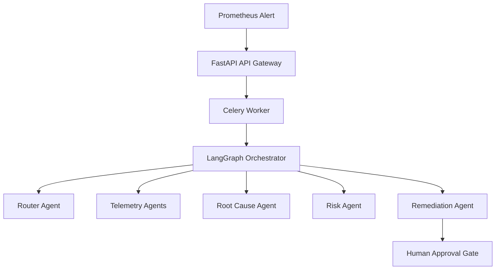

# Current System Architecture

SentinelOps uses a modular micro-services architecture to orchestrate incident investigation and resolution.

## Component Overview

1. **API Gateway (FastAPI)**: Handlers for webhooks, incident tracking, approvals, and metrics.
2. **LangGraph Orchestrator**: Manages state transition graphs and invokes metrics/logs/deployment agents.
3. **Worker Pool (Celery)**: Background execution environment for long-running workflows.
4. **Telemetry Layer (Prometheus/Loki/Tempo)**: Gathers live production signals.

## System Topology

